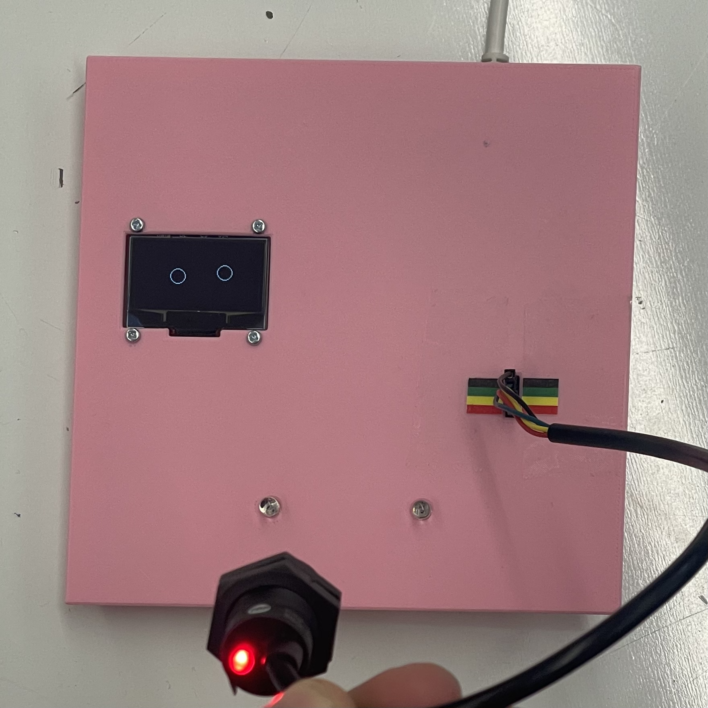

# IRCamera_test_box
Code and CAD for the WPI RBE noiles IR camera test box

# How to use

To plug in the IR camera plug in top to bottom

  Black 
  Green 
  Yellow 
  Red 

  Point the camera at the LED's and you should see a red light on the IR camera and circles on the OLED showing the location of the LED's with respect to the cameras field of view
  

  

  

# Wiring

  <b>Components:</b> 
  1x STEMA QT 128x64 OLED display (https://www.adafruit.com/product/326) 
  1x ESP23_devkitc_v4  
  2x 5mm IR LED 

  

  <b>Wiring:</b> 
  OLED vin -> ESP 5V 
  OLED gnd -> ESP gnd 
  OLED rst -> ESP 23 
  OLED clk -> ESP 22 
  OLED data -> ESP 21 
  
  LED+ -> 330 ohm -> ESP 5V 
  LED- -> ESP gnd 
  
  

# CAD and Assembly

  <b>Components:</b>  
  1x 3D printed box (CAD avalible in repo)  
  4x 2-56 0.25" Pan head bolt  
  4x 2-26 nut  
  10x M3 Heat inset nut  
  10x M3 6mm socket head cap screw  

  <b> Assembly:</b> 
  1) Insert all heat insert nuts into box top. There are 2 inserts per side and 2 inserts to mount the ESP32 
  2) Screw the SDoldered prototyping board and the OLED display to the printed box top. Use M3 screws for the board and 2-56 for the OLED  
  2) Print the pinout colors PDF and tape it to the box to indicate the correct IR Camera wiring 

   
  

